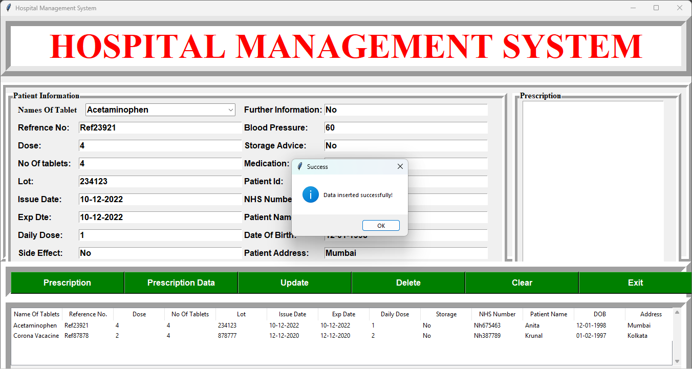
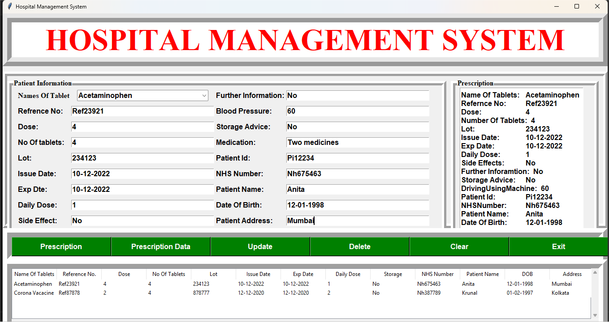

# 🏥 Hospital Management System

A desktop-based Hospital Management System developed using **Python (Tkinter)** and **MySQL**. This application allows users to manage patient prescription records efficiently through a graphical user interface (GUI) integrated with a relational database.

## 📌 Project Description

The Hospital Management System is designed to store, manage, and update patient prescription data in a structured manner.

It provides a user-friendly interface where hospital staff can:

- Enter new patient prescription details
- Update existing records
- Delete patient information
- View all stored records in tabular format
- Generate prescription summaries

This project demonstrates the integration of a front-end GUI with a backend database, simulating a real-world hospital data management system.

---

## 🎯 Purpose of the Project

The main objectives of this project are:

- To understand how GUI applications interact with databases
- To implement CRUD operations (Create, Read, Update, Delete)
- To simulate real-world data management systems
- To strengthen backend development and database connectivity skills

---

## 🚀 Features

- ➕ Add new patient prescription records  
- ✏️ Update existing patient data  
- ❌ Delete patient records  
- 📋 Display all records using a Treeview table  
- 🔄 Automatically fetch data from MySQL database  
- 🧹 Clear input fields functionality  
- 📝 Generate formatted prescription summary  
- ⚠️ Error handling using message boxes  

---

## 🛠️ Technologies Used

- **Python**
- **Tkinter** (GUI Development)
- **MySQL** (Database Management)
- **mysql-connector-python** (Database Connectivity)

---

## 🗄️ Database Setup

The project uses a MySQL database named:
aidata
with a table: hospitalm
To create the database and table:
1. Open MySQL Workbench
2. Run the file 'HospitalM.sql'

